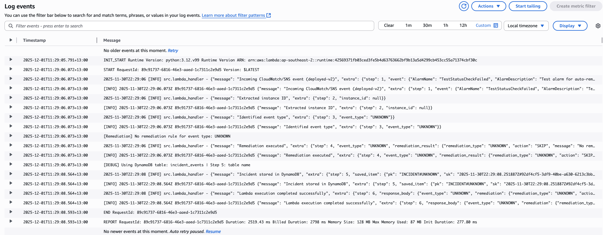
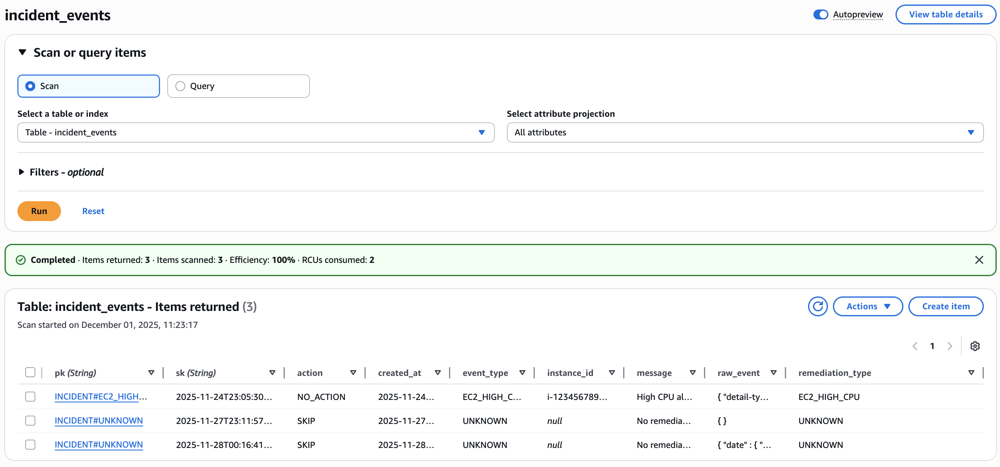
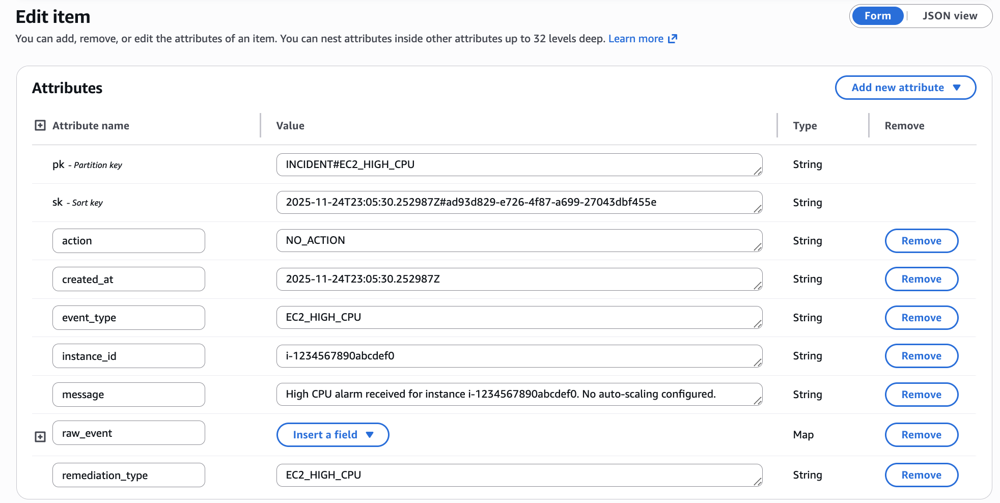
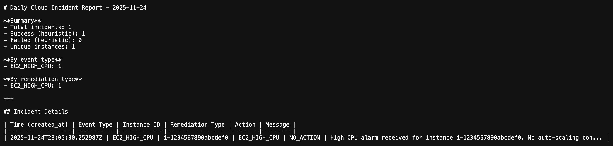
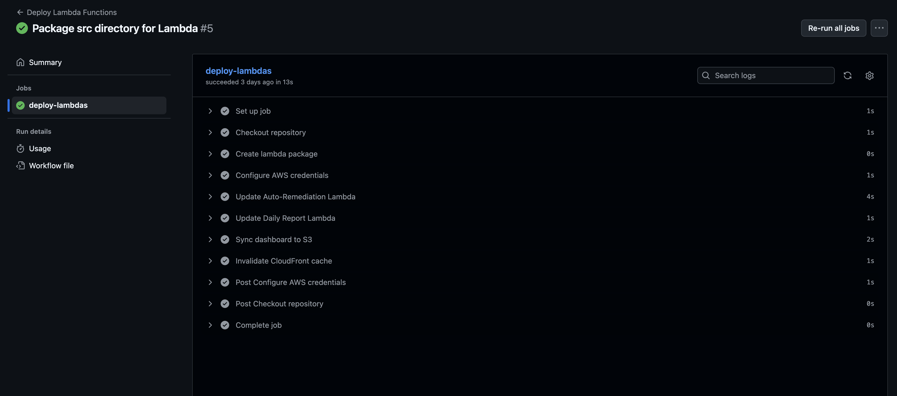

# 🌩️ Cloud Incident Response & Auto-Remediation System

> A fully deployed, AWS-based incident response pipeline with automated remediation, daily reporting, and a CloudFront-hosted dashboard.

Modern Cloud Support / SRE teams can’t manually babysit every EC2 instance.  
This project demonstrates how to build a **production-style, event-driven incident response system** on AWS:

- Detect EC2 incidents via CloudWatch Alarms (CloudWatch → SNS → Lambda)
- Automatically run remediation actions (reboot / start / investigate)
- Log every incident and outcome into DynamoDB for auditability
- Generate a **daily Markdown incident report**
- Email the report to operators via SES
- Serve the latest report on an S3 + CloudFront dashboard
- Use GitHub Actions CI/CD to deploy backend Lambdas and the dashboard automatically

---

## 📸 Dashboard Preview

The Cloud Incident Dashboard is delivered through S3 + CloudFront and renders the latest Markdown report directly from S3.


---

## 🚀 Live Demo

👉 **https://d1uh2al28gwt3d.cloudfront.net/**

This CloudFront-distributed dashboard fetches the **latest Markdown incident report** directly from S3 and renders it at runtime.  
It is a fully static, globally cached frontend with real-time data sourced from the Daily Report Lambda.

> If there are no incidents for the current date, the dashboard will display an empty state — this is expected behavior, as reports are generated only when DynamoDB contains incidents for that day.

---

## 🧭 End-to-End System Overview

This project implements a **fully event-driven Cloud Incident Response pipeline** running entirely on AWS.  
The architecture handles the complete lifecycle of an EC2 incident — detection, remediation, logging, reporting, and visualization.

### 🔧 Auto-Remediation Lambda

Receives CloudWatch → SNS events, extracts the instance and event type, and triggers the appropriate remediation rule (reboot, auto-start, or investigation).  
All actions use modular handlers under `src/remediation/`.

### 🔍 Auto-Remediation Execution Log (CloudWatch)



This log shows:

- Incoming CloudWatch/SNS event received by the Lambda
- Event type classification
- Remediation rule execution
- Structured incident saved to DynamoDB

### 🗂 Incident Logging (DynamoDB)

Each remediation attempt is written as a structured record into the `incident_events` table, including:

- event type
- instance ID
- remediation action
- result (SUCCESS / FAILED / DRYRUN)
- timestamp
- raw CloudWatch event payload

### 📅 Daily Report Lambda (SES + S3)

Runs once per day (EventBridge-compatible) to generate a **Markdown incident report**:

1. Query DynamoDB for all incidents of that date
2. Build a human-readable Markdown file
3. Send the report via SES email
4. Upload the Markdown report to S3 for long-term retention

### 📊 Cloud Incident Dashboard (S3 + CloudFront)

A globally cached static dashboard that fetches Markdown reports directly from S3 and renders:

- summary metrics
- incident tables
- report content

### 🔄 CI/CD Pipeline (GitHub Actions → AWS)

A fully automated deployment pipeline that:

- packages the Lambda source (`/src`)
- deploys Auto-Remediation + Daily Report Lambdas
- syncs the dashboard to S3
- invalidates CloudFront to propagate changes globally

---

## 🏗 Architecture


This diagram represents the full event-driven flow of the system — from CloudWatch alarm detection, to automated Lambda remediation, to reporting and visualization.

### ✔ Deployed Components (Live in AWS)

| Component                    | Status                                               |
| ---------------------------- | ---------------------------------------------------- |
| CloudWatch Alarms            | ✅ Trigger EC2 health events                         |
| SNS Topic                    | ✅ Forwards CloudWatch events to Lambda              |
| Auto-Remediation Lambda      | ✅ Parses events, executes remediation, logs results |
| DynamoDB (`incident_events`) | ✅ Stores structured incident records                |
| Daily Report Lambda          | ✅ Generates Markdown + sends SES + uploads to S3    |
| S3 `daily-reports` bucket    | ✅ Stores daily Markdown report history              |
| CloudFront Dashboard         | ✅ Renders reports dynamically from S3               |
| SES                          | ✅ Verified sender + email delivery working          |
| GitHub Actions CI/CD         | ✅ Auto-deploys backend and dashboard                |

### 📌 Optional Extensions (not required for core functionality)

| Enhancement                                 | Status                   |
| ------------------------------------------- | ------------------------ |
| EventBridge scheduled daily reporting       | ⏳ Not enabled by design |
| Additional CloudWatch alarms (CPU, network) | ⏳ Expandable            |
| Extra remediation rules (RDS, ALB, S3)      | ⏳ Future extensions     |

---

## ✨ Features

### 🔁 Automated EC2 Remediation (Lambda)

The main Lambda function receives CloudWatch → SNS events, classifies the incident,  
and triggers modular remediation handlers.

Supported rules:

- **StatusCheckFailed** → attempt reboot (DryRun or real action)
- **UnexpectedStop** → attempt start (DryRun or real action)
- **HighCPU** → detection + structured logging
- All actions logged with consistent JSON formatting visible in CloudWatch Logs

A simplified routing example:

```python
def run_remediation(event_type, event):
    handlers = {
        "EC2_STATUS_CHECK_FAILED": handle_status_check_failed,
        "EC2_UNEXPECTED_STOP": handle_unexpected_stop,
        "EC2_HIGH_CPU": handle_high_cpu
    }
    return handlers[event_type](event)
```

### 🗂 Structured Incident Logging (DynamoDB)

Every remediation attempt is written to DynamoDB using a time-ordered schema:

```json
{
  "pk": "INCIDENT#{event_type}",
  "sk": "2025-11-30T02:34:12Z#7fce2e43",
  "instance_id": "i-0123456789abcdef0",
  "action": "REBOOT",
  "result": "SUCCESS",
  "message": "Reboot initiated",
  "raw_event": { "... CloudWatch payload ..." }
}
```

Key design features:

- pk groups incidents by event type
- sk ensures chronological ordering
- Daily report uses begins_with(date) for efficient queries

### 🗂 DynamoDB Incident Logging (Screenshots)

**List of incidents**


**Detailed incident record**


### 📅 Daily Markdown Reporting (SES + S3)

A scheduled Lambda (EventBridge-ready) generates a fully formatted Markdown report:

1. Query DynamoDB by date prefix
2. Aggregate statistics (counts, success rate, events by type)
3. Build a Markdown file
4. Send via SES
5. Upload to S3 for long-term retention

Sample output:

```
# Daily Incident Report — 2025-11-30
- Total incidents: 3
- Successful remediations: 2
- Failed: 1
```

#### 📂 S3 Report Storage

**Daily report files stored in S3 (`daily-reports/`):**


**Example Markdown report preview:**


### 💻 Cloud Incident Dashboard (S3 + CloudFront)

A static, globally cached dashboard that:

- fetches Markdown reports directly from S3
- renders metrics + incident tables client-side
- updates instantly via CloudFront invalidation in CI/CD
- uses no backend — the data layer is fully serverless

---

## 🔧 CI/CD Pipeline (GitHub Actions)

A fully automated CI/CD pipeline handles deployment for both the backend Lambdas and the CloudFront dashboard.  
All deployments happen on **every push to `main`**, ensuring zero manual steps and consistent rollouts.

### 🛠 How the pipeline works

1. Install Python + dependencies
2. Package the Lambda source (`/src`) into deployment zip files
3. Update both Lambda functions using the AWS CLI
4. Sync the `dashboard/` directory to the S3 bucket
5. Invalidate CloudFront to propagate updates globally

This workflow enables **zero-touch deployments** across the entire system.

#### 🔧 CI/CD Steps (GitHub Actions)



This pipeline performs:

- Lambda packaging
- Automated deployment of both Lambda functions
- Dashboard sync to S3
- CloudFront cache invalidation
- Fully zero-touch continuous deployment

---

### 🧩 Example workflow snippet (`deploy.yml`)

```yaml
name: Deploy

on:
  push:
    branches: ["main"]

jobs:
  deploy:
    runs-on: ubuntu-latest

    steps:
      - name: Checkout repo
        uses: actions/checkout@v4

      - name: Set up Python
        uses: actions/setup-python@v4
        with:
          python-version: "3.10"

      - name: Package Lambda
        run: |
          cd src
          zip -r ../lambda.zip .

      - name: Configure AWS credentials
        uses: aws-actions/configure-aws-credentials@v4
        with:
          aws-access-key-id: ${{ secrets.AWS_ACCESS_KEY_ID }}
          aws-secret-access-key: ${{ secrets.AWS_SECRET_ACCESS_KEY }}
          aws-region: ${{ secrets.AWS_REGION }}

      - name: Update Auto-Remediation Lambda
        run: |
          aws lambda update-function-code \
            --function-name ${{ secrets.LAMBDA_MAIN_NAME }} \
            --zip-file fileb://lambda.zip

      - name: Update Daily Report Lambda
        run: |
          aws lambda update-function-code \
            --function-name ${{ secrets.LAMBDA_REPORT_NAME }} \
            --zip-file fileb://lambda.zip

      - name: Sync dashboard to S3
        run: |
          aws s3 sync dashboard/ s3://${{ secrets.S3_DASHBOARD_BUCKET }}/ --delete

      - name: Invalidate CloudFront
        run: |
          aws cloudfront create-invalidation \
            --distribution-id ${{ secrets.CLOUDFRONT_DISTRIBUTION_ID }} \
            --paths "/*"
```

### 🔐 Security & IAM

- GitHub Actions uses GitHub Secrets
- IAM credentials follow least privilege (Lambda update + S3 sync + CloudFront invalidation only)
- No AWS credentials stored in the repo

### 📌 CI/CD Highlights

- Zero manual deployment steps
- Consistent releases for both Lambdas and frontend
- Global propagation via automatic CloudFront invalidation
- Clear separation of responsibilities (backend vs dashboard)
- Fast iteration loop — push to main → new version goes live within seconds

---

## 🛠 Tech Stack

### ☁️ AWS (Serverless & Event-Driven)

- **Lambda** — auto-remediation engine + daily reporting
- **CloudWatch** — EC2 health monitoring & alarm triggers
- **SNS** — event distribution to Lambda
- **DynamoDB** — structured incident logging with time-ordered schema
- **S3** — Markdown report storage + dashboard hosting
- **CloudFront** — global CDN for the dashboard
- **SES** — automated delivery of incident reports
- **EventBridge** — (ready) scheduling for daily reports

### 🐍 Python Backend

- `boto3` — AWS SDK for remediation, S3 uploads, SES email
- Modular code structure (`remediation/`, `reporting/`, `storage/`)
- `logging` — unified JSON logging for CloudWatch
- Strong separation of concerns (router → handler → persistence)

### 🛠 DevOps / CI/CD

- **GitHub Actions** — full pipeline for Lambda packaging & deployment
- **AWS CLI** — Lambda updates, S3 sync, CloudFront invalidation
- **IAM Roles** — least privilege for CI/CD + runtime
- Automated, zero-touch deployment workflow

### 🎨 Frontend (Dashboard)

- Static HTML/CSS/JS
- Client-side Markdown parsing
- S3 as a data backend (no API needed)
- CloudFront edge caching for instant global access

---

## 🚀 Future Enhancements (Optional Extensions)

The core incident response pipeline is fully complete.  
The following enhancements represent optional, production-style extensions that can further expand the system:

### 📊 Observability & Reporting

- Add trend visualizations (7-day & 30-day incident charts)
- Add CloudWatch Logs Insights queries for remediation analytics
- Generate PDF versions of daily/weekly reports

### 🛠 Advanced Auto-Remediation

- Additional EC2 remediation rules (network failures, reachability checks)
- Cross-service remediation (ALB health, RDS failover alerts, S3 event anomalies)
- Conditional or severity-based remediation flows

### 🔗 Integrations

- Slack / Microsoft Teams webhook notifications
- PagerDuty or OpsGenie integration
- Add webhook endpoints for external automation tools

### 🧱 Infrastructure as Code (IaC)

- Full Terraform/CloudFormation/CDK definitions for:
  - Lambda, DynamoDB, S3, SES, CloudFront, IAM roles
  - CloudWatch alarms & EventBridge rules
- One-command deployment pipeline

### 🌍 Architecture Enhancements

- Multi-region report replication
- Edge-cached incident API using CloudFront Functions
- Optional API Gateway layer for structured report access

### 💸 Cost Optimization

- DynamoDB TTL + S3 intelligent tiering for long-term retention
- Lambda packaging minimization (layer split)
- CloudFront caching optimized for Markdown assets

---

## 🗂 Project Structure

The project follows a clean, modular layout separating remediation logic, reporting, storage, utilities, and dashboard assets.

```
cloud-incident-auto-remediation/
├── README.md
├── architecture-diagram.png
├── requirements.txt
│
├── screenshots/                          # Project evidence & UI previews
│   ├── dashboard-overview.png            # CloudFront dashboard UI
│   ├── incident-events-table.png         # DynamoDB table (list view)
│   ├── incident-event-detail.png         # DynamoDB item detail
│   ├── cloudwatch-remediation-log.png    # Auto-Remediation Lambda CloudWatch logs
│   ├── s3-daily-reports-list.png         # S3 daily-reports/ list
│   ├── s3-daily-report-content.png       # Example Markdown report preview
│   ├── cicd-actions-success.png          # GitHub Actions overall success
│   └── cicd-steps.png                    # GitHub Actions deployment steps
│
├── src/                                  # Backend Lambda source code
│   ├── lambda_handler.py                 # Main auto-remediation Lambda
│   ├── daily_report_lambda.py            # Daily Markdown report Lambda
│   │
│   ├── remediation/                      # Auto-remediation rules
│   │   ├── ec2_status_check.py
│   │   ├── ec2_high_cpu.py
│   │   ├── ec2_unexpected_stop.py
│   │   └── __init__.py
│   │
│   ├── event_router.py                   # Event classification + instance extraction
│   │
│   ├── reporting/                        # Reporting (Markdown + SES)
│   │   ├── daily_report.py
│   │   ├── send_email.py
│   │   └── __init__.py
│   │
│   ├── storage/                          # DynamoDB interface
│   │   ├── dynamodb_client.py
│   │   └── __init__.py
│   │
│   ├── utils/                            # Shared utilities
│   │   ├── aws_clients.py
│   │   ├── config.py
│   │   ├── logging_utils.py
│   │   └── __init__.py
│   │
│   └── __init__.py
│
├── dashboard/                            # CloudFront-hosted static dashboard
│   ├── index.html
│   ├── app.js
│   └── styles.css
│
├── reports/                              # Demonstration/sample data (optional)
│   ├── sample-daily-report.md
│   └── sample-event-log.json
│
└── .github/
    └── workflows/
        └── deploy.yml                    # GitHub Actions CI/CD pipeline

```

### 🔍 Key Directory Highlights

- **src/remediation/**  
  Modular rule-based architecture for EC2 remediation (reboot / start / investigation).

- **src/reporting/**  
  Markdown generator + SES delivery utilities.

- **src/storage/**  
  Single DynamoDB abstraction layer—helps maintain clean separation of concerns.

- **dashboard/**  
  Static CloudFront UI that consumes Markdown directly from S3 (no backend required).

- **.github/workflows/**  
  Automated CI/CD pipeline for Lambda + dashboard deployments.
