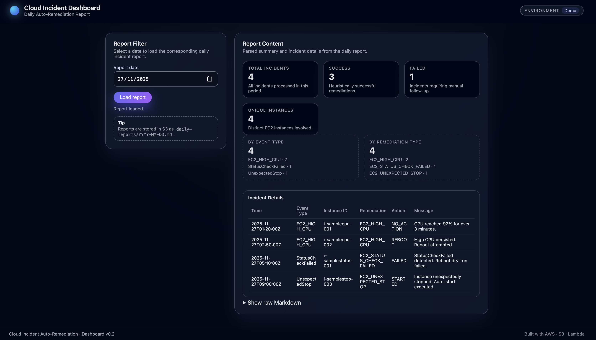
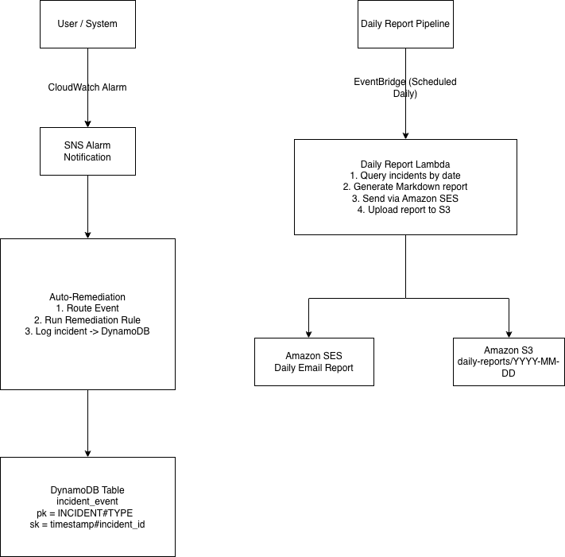

# 🌩️ Cloud Incident Response & Auto-Remediation System

> A fully deployed AWS-based Cloud Incident Response system featuring automated remediation, daily reporting, and a CloudFront-hosted dashboard.

This project replicates a real-world Cloud Support / SRE workflow:

- Detect EC2 incidents (CloudWatch → SNS → Lambda)
- Automatically remediate issues
- Log all incidents to DynamoDB
- Generate a daily Markdown incident report
- Email the report via SES
- Serve the report on an S3 + CloudFront dashboard
- CI/CD deploys all backend and frontend changes automatically

---

## 📸 Screenshot



---

## 🚀 Live Demo

👉 **https://d1uh2al28gwt3d.cloudfront.net/**

The dashboard pulls Markdown reports directly from S3 and renders them dynamically.

The dashboard renders the latest Markdown report from S3.
If no incidents exist for today, the dashboard may appear empty.

---

## 🧭 End-to-End System Overview

The system is fully deployed on AWS:

- **Auto-Remediation Lambda**  
  Parses CloudWatch Alarm events, identifies incident types, and executes remediation actions.

- **Incident Logging (DynamoDB)**  
  Every incident (event payload + remediation result) is written into the `incident_events` table.

- **Daily Report Lambda**

  - Reads all incidents for the given date from DynamoDB
  - Generates Markdown
  - Sends via SES
  - Uploads to S3
  - (Trigger-ready: EventBridge cron)

- **Cloud Incident Dashboard (S3 + CloudFront)**

  - Fetches Markdown reports from S3
  - Renders summary metrics + tables

- **CI/CD (GitHub Actions → AWS)**
  - Packages `/src` into a Lambda zip
  - Deploys AutoRemediation + DailyReport Lambda
  - Syncs dashboard/ to S3
  - Invalidates CloudFront

---

## 🏗 Architecture



### ✔ Currently live in AWS

| Component                    | Status                                      |
| ---------------------------- | ------------------------------------------- |
| Auto-Remediation Lambda      | ✅ Deployed & writing to DynamoDB           |
| Daily Report Lambda          | ✅ Sends SES email + uploads Markdown to S3 |
| DynamoDB (`incident_events`) | ✅ Online                                   |
| S3 daily-reports bucket      | ✅ Live                                     |
| SES                          | ✅ Verified & working                       |
| Dashboard (S3 + CloudFront)  | ✅ Live, renders Markdown                   |
| CI/CD pipeline               | ✅ Auto-deploys backend & frontend          |

### ⏳ Next step (optional)

| Component                             | Status                                                |
| ------------------------------------- | ----------------------------------------------------- |
| CloudWatch Alarms → SNS wiring        | 🔸 Pending (connect EC2 alarms to remediation Lambda) |
| EventBridge scheduled daily reporting | 🔸 Ready (not yet enabled)                            |

---

## ✨ Features

### 🔁 Auto-Remediation Lambda

- StatusCheckFailed → auto-reboot (DryRun)
- UnexpectedStop → auto-start (DryRun)
- HighCPU: detection + logging (no automated action yet)
- JSON log format (traceable in CloudWatch)
- Structured incident record stored in DynamoDB

### 🗂 DynamoDB Incident Logging

Each record includes:

```json
{
  "pk": "INCIDENT#{event_type}",
  "sk": "{timestamp}#{uuid}",
  "event_type": "...",
  "instance_id": "...",
  "remediation_type": "...",
  "action": "SUCCESS / FAILED / SKIP",
  "message": "...",
  "raw_event": { ... }
}
```

### 📅 Daily Report Lambda (SES + S3)

- Query DynamoDB by date prefix
- Builds a human-readable Markdown summary:
  - Total incidents
  - Success / Failed
  - Events by type
  - Incidents by instance
- Sends email via SES
- Uploads Markdown to S3

### 💻 Incident Dashboard (S3 + CloudFront)

- Fetches Markdown from S3 at runtime
- Renders metrics + tables + raw content

---

## 🔧 CI/CD Pipeline (GitHub Actions)

Every push to **main**:

1. zip -r lambda.zip src/
2. Deploys CloudIncidentAutoRemediation
3. Deploys CloudIncidentDailyReport
4. Syncs dashboard/ to S3
5. Invalidates CloudFront cache

This provides production-level deployment automation.

---

## 🛠 Tech Stack

- AWS: Lambda · CloudWatch · SNS · EC2 · DynamoDB · EventBridge · SES · S3 · CloudFront
- Python: boto3, structured modules
- Frontend: HTML + CSS + JS (Markdown renderer)
- DevOps: GitHub Actions · IAM Roles · S3 Website Hosting

---

## 🚀 Future Enhancements

- Connect real EC2 alarms (CloudWatch → SNS)
- Enable daily scheduling via EventBridge
- Add charts and incident trends to Dashboard
- Add Slack/Teams webhook notifications
- Add IaC (CloudFormation/Terraform/CDK)
- Expand remediation rules (RDS / ALB / S3)

---

## 🗂 Project Structure

```
cloud-incident-auto-remediation/
├── README.md
├── architecture-diagram.png              # ✅ Architecture diagram
├── requirements.txt                      # ✅ Dependencies for Lambda + local development
│
├── screenshots/                          # UI & dashboard screenshots
│   └── dashboard-overview.png            # ✅ Dashboard preview
│   ├── daily-report-preview.png          # Optional: sample daily report rendering
│   └── system-flow.png                   # Optional: incident system flow diagram
│
├── src/
│ ├── lambda_handler.py                   # ✅ Main remediation Lambda (parse → route → remediate)
│ ├── event_router.py                     # ✅ Event type classifier (CPU, StatusCheckFailed, Stop)
│ ├── daily_report_lambda.py              # ✅ Daily report Lambda (DynamoDB → SES + S3)
│ │
│ ├── remediation/                        # Auto-remediation rules
│ │ ├── ec2_status_check.py               # ✅ StatusCheckFailed remediation
│ │ ├── ec2_high_cpu.py                   # ✅ High CPU remediation (MVP)
│ │ ├── ec2_unexpected_stop.py            # ✅ Unexpected Stop → auto-start (DryRun)
│ │ └── __init__.py
│ │
│ ├── reporting/                          # Daily report modules (Phase 4)
│ │ ├── daily_report.py                   # ✅ Generate daily report from DynamoDB
│ │ ├── send_email.py                     # ✅ Send report via SES
│ │ └── __init__.py
│ │
│ ├── storage/
│ │ ├── dynamodb_client.py                # ✅ Write/read incidents (incident_events table)
│ │ └── __init__.py
│ │
│ ├── utils/
│ │ ├── aws_clients.py                    # ✅ boto3 client/resource factory
│ │ ├── config.py                         # ✅ Configuration (table names, buckets, emails)
│ │ ├── logging_utils.py                  # ✅ Unified Lambda logging format
│ │ └── __init__.py
│ │
│ └── __init__.py

├── infra/                                # IaC definitions (optional for now)
│ ├── cloudwatch-alarms.yaml              # ☐ CloudWatch + SNS alarm definitions
│ ├── lambda-roles-policies.yaml          # ☐ IAM permissions / trust policies
│ ├── dynamodb-table.yaml                 # ☐ incident_events table definition
│ └── eventbridge-rules.yaml              # ☐ Daily cron rule for report Lambda

├── scripts/
│ ├── simulate_event.py                   # ✅ Local CloudWatch event simulator
│ ├── seed_sample_data.py                 # ☐ Write sample incidents to DynamoDB
│ └── manual_report.py                    # ☐ Local manual report generator

├── dashboard/                            # CloudFront-hosted incident dashboard
│ ├── index.html                          # ✅ Dashboard page (S3 + CloudFront)
│ ├── app.js
│ └── styles.css

├── reports/
│ ├── sample-daily-report.md              # ✅ Example of daily report (for recruiters)
│ └── sample-event-log.json               # ✅ Example of logged incident

├── docker/
│ ├── Dockerfile                          # ☐ Local Lambda/testing Docker image
│ └── README.md

└── .github/
    └── workflows/
        └── deploy.yml                    # ✅ GitHub Actions CI/CD pipeline

```
